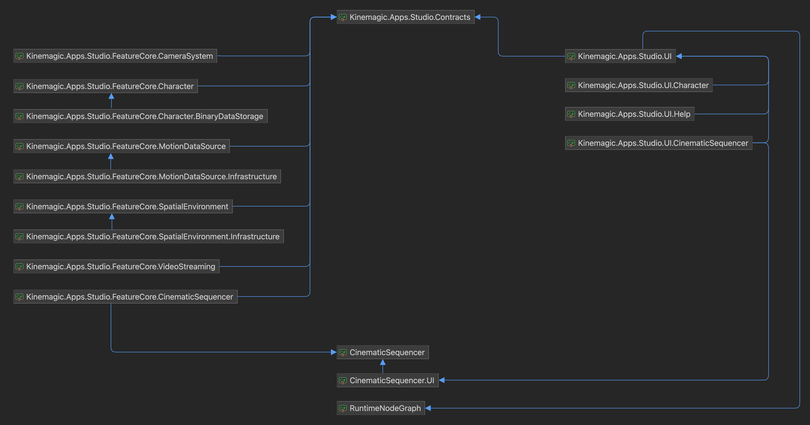

# Kinemagic Studio - Community Edition

映像制作・ライブ配信のための3Dアバター動画撮影ソフトのオープンソース版プロジェクトです。

## 開発環境
- Unity 6000.0.56f1

## プロジェクト構成
### フォルダ構成
```
src/
├── Apps/
│   ├── KinemagicStudio-CE/                   # Unityプロジェクト
│   │   └── Assets/
│   │       └── Kinemagic/
│   │           ├── Apps.Studio/
│   │           ├── Apps.Studio.Contracts/
│   │           ├── Apps.Studio.FeatureCore/
│   │           ├── Apps.Studio.UI/
│   │           └── Misc/
│   │
│   └── Shared/                               # 共有ライブラリ・共有アセット
│       ├── Kinemagic.AppCore.Utils/
│       └── ThirdParty/
│
└── Packages/                                 # 汎用的なUnityパッケージ
    ├── CinematicSequencer/
    ├── CinematicSequencer.UI/
    ├── EngineLooper/
    └── RuntimeNodeGraph/
```

### 依存関係


### 依存ライブラリ
- [UniTask](https://github.com/Cysharp/UniTask)
- [MessagePipe](https://github.com/Cysharp/MessagePipe)
- [R3](https://github.com/Cysharp/R3)
- [VContainer](https://github.com/hadashiA/VContainer)
- [UniVRM](https://github.com/vrm-c/UniVRM)
- [glTFast](https://github.com/atteneder/glTFast)
- [uOSC](https://github.com/hecomi/uOSC)
- [KlakSpout](https://github.com/keijiro/KlakSpout)
- [KlakSyphon](https://github.com/keijiro/KlakSyphon)
- [NuGetForUnity](https://github.com/GlitchEnzo/NuGetForUnity)
- [ContextualMenuPlayer](https://github.com/sotanmochi/ContextualMenuPlayer)
- [FacialCaptureSync](https://github.com/sotanmochi/FacialCaptureSync)
- [UniVRM Material Extensions](https://github.com/sotanmochi/UniVRMMaterialExtensions)
- [lilToon](https://github.com/lilxyzw/lilToon)

## オープンソース版と製品版について
- [Kinemagic Studio](https://kinemagicstudio.github.io/)の各エディションは、オープンソース版（Community Edition）をベースにして開発されています。
- 製品版は、「有償のアセット・ライブラリ」や「オープンソースとして公開・再配布できないアセット・ライブラリ」などを含めてビルドされています。
- エディションによって、実装されている機能や利用条件が異なります。詳しくは製品版の[利用規約](https://kinemagicstudio.github.io/docs/terms/terms-of-use)などを確認してください。

## ライセンス情報
- [MITライセンス](LICENSE.txt)
- [サードパーティ通知](THIRD-PARTY-NOTICES.txt)
